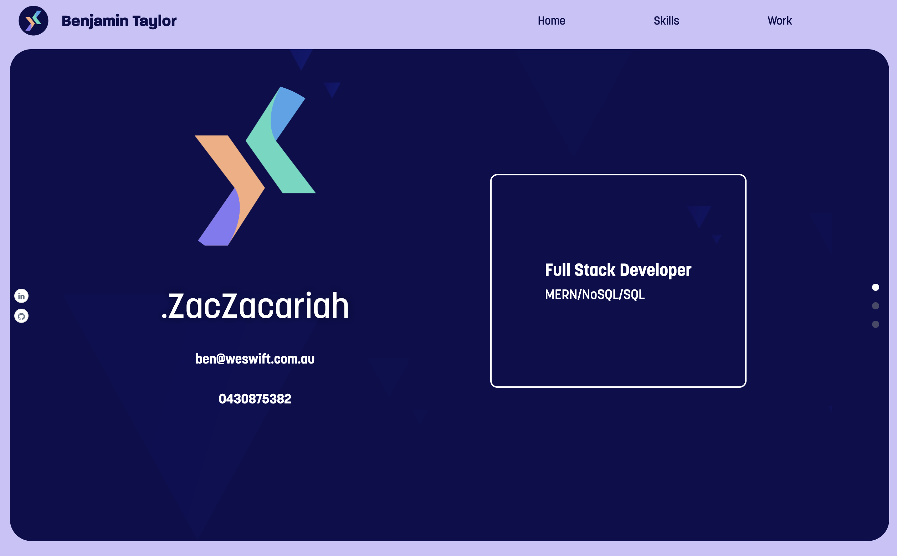

# PersonalPortfolio

## Description

THis is a react build personal profile show casing my skills and work.

Deployment:

## Table of Contents 

- [Installation](#installation)
- [Usage](#usage)
- [Credits](#credits)
- [License](#license)

## Installation

How do I install Dependencies?
npm i

## Usage

Use this app too see a virtual resume of my professional portfolio

## Credits

## License 

This project is licensed under the MIT License.

Find more about this license here: https://opensource.org/licenses/MIT.

        

## Tests

How do I run tests?
npm start

## Questions

Please direct your questions towards Ben at:
Github: zaczacariah
Email: ben-zac@outlook.com

    